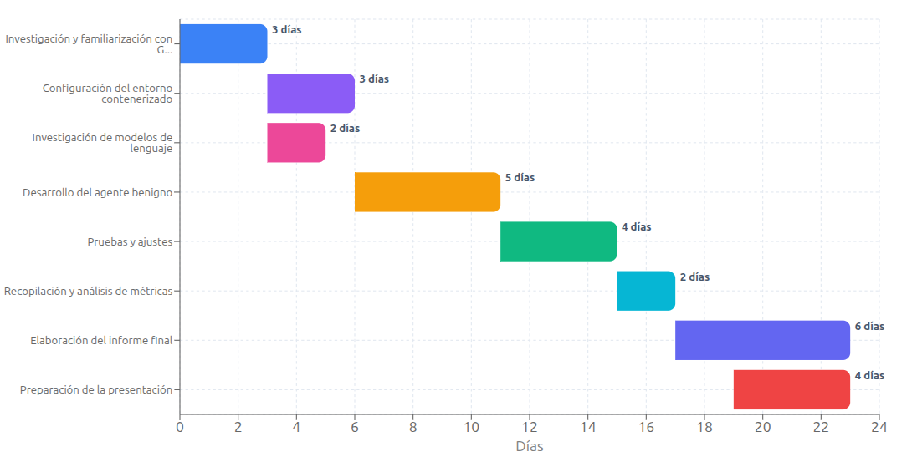

# Anteproyecto final - IA

# Evaluación Comparativa de Modelos LLM para Agentes que Simulan Usuarios Reales en Gestión de Bases de Datos

**Código del proyecto:** BENIGNO

**Integrantes:**
- Baggio Rocio
- Fernandez Julian

## Descripción

El proyecto consiste en desarrollar un agente benigno que simula el comportamiento de un usuario real interactuando con una base de datos a través de una terminal Linux en un entorno contenerizado. Utilizando GHOSTS (framework de simulación de NPCs de Carnegie Mellon University), se implementará un agente que recibe instrucciones y las ejecuta de manera autónoma, simulando las acciones que realizaría un usuario humano en escenarios reales de administración de bases de datos.

El objetivo principal es evaluar diferentes modelos de lenguaje de gran escala (LLM) como motor de razonamiento del agente, comparando su capacidad para interpretar instrucciones, ejecutar comandos correctamente y completar tareas de manera eficiente y precisa. A través de métricas objetivas, se determinará qué modelo LLM proporciona el mejor rendimiento para este tipo de tareas automatizadas.

## Objetivo del Proyecto

**Objetivo general:** Evaluar y comparar el desempeño de diferentes modelos LLM (GPT-4, Claude, Llama 3, entre otros) implementados en un agente que simula comportamiento de usuario real, determinando cuál modelo ejecuta tareas de gestión de bases de datos con mayor precisión, eficiencia y cumplimiento de consignas.

## Métricas

- **Tasa de Comandos Ejecutados sin Errores (TCSE):** Porcentaje de comandos que se ejecutan sin errores.
- **Cumplimiento de Consignas (CC):** Mide si el agente hace exactamente lo pedido, evaluando completitud, corrección y que no haga cosas extra.
- **Tiempo de Construcción y Ejecución de Consultas (TCEC):** Tiempo promedio desde recibir una instrucción hasta completar la tarea exitosamente.

## Herramientas

### Framework y Simulación
- **GHOSTS (v7.0+):** Framework de simulación de NPCs desarrollado en C#/.NET para generar comportamientos realistas y automatización
- **GHOSTS Shadows:** Servicio de IA implementado en Python con Flask y Gradio para acceso a LLMs locales
- **Docker (v24.0+):** Contenedorización del entorno de simulación
- **Docker Compose:** Orquestación de múltiples contenedores (base de datos, agente, GHOSTS)

### Desarrollo
- **Python 3:** Lenguaje para componentes auxiliares (GHOSTS Shadows, herramientas de generación de contenido)

### Bases de Datos
- **PostgreSQL (v15+):** Sistema de gestión de base de datos relacional principal

## Justificación

Este proyecto es esencial para validar una hipótesis de seguridad dentro del marco de un proyecto mayor: un lightweight framework diseñado para entrenar y evaluar agentes cibernéticos (defensores, atacantes y benignos) en entornos realistas y contenerizados. El objetivo principal es construir y validar Defensores robustos. Para ello, nuestro proyecto modela y mide cómo el comportamiento simulado de un usuario legítimo (Agente Benigno o Distractor) impacta directamente la capacidad de un Agente Defensor para detectar a un Atacante.

Buscamos determinar si la distracción generada por el agente benigno reduce el rendimiento del Defensor y, en consecuencia, beneficia al Atacante al aumentar su probabilidad de éxito. Los Defensores deben ser probados y validados bajo el ruido de la actividad legítima de usuarios. Los resultados aseguran que las tácticas defensivas integradas en el framework sean fiables para la detección y respuesta automatizada en contextos de operación real, donde el ambiente de trabajo siempre es no ideal.

### Marco Teórico 
Los modelos de lenguaje (LLMs) han demostrado capacidades excepcionales para tareas de razonamientom planificación y ejecución de comandos en entornos técnicos. 
La arquitectura de los agentes basados en LLMs permite simular comportamientos humanos complejos mediante la combinación de capacidades como la comprensión de textos, generación de planes de acción y adaptación a instrucciones dinámicas. 
En particular, en el ámbito de administración de bases de datosm los LLM's han mostrado potencial para traducir instrucciones en lenguaje natural a comandos SQL y operaciones de terminal, lo que los hace ideales para simular usuarios reales en entornos contenerizados. 

## Alcances y Limitaciones del Proyecto

### Alcances

El proyecto abarca los siguientes aspectos:

#### 1. Interacción con Bases de Datos
- **Operaciones SQL básicas e intermedias:** El agente será capaz de ejecutar consultas SELECT, INSERT, UPDATE, DELETE, y operaciones de agregación (COUNT, SUM, AVG, etc.).
- **Gestión de esquemas:** Creación, modificación y eliminación de tablas (CREATE TABLE, ALTER TABLE, DROP TABLE).
- **Consultas con JOINs:** Consultas que involucran múltiples tablas relacionadas (INNER JOIN, LEFT JOIN, RIGHT JOIN).
- **Uso de subconsultas:** Queries anidadas y consultas complejas con subselects.

#### 2. Interfaz de Línea de Comandos (CLI)
- **Trabajo exclusivo por línea de comando:** El agente interactuará con PostgreSQL mediante la herramienta `psql` en terminal Linux.
- **Ejecución de scripts SQL:** Capacidad de ejecutar archivos .sql mediante `psql -f archivo.sql`.
- **Comandos meta de psql:** Uso de comandos especiales como `\dt` (listar tablas), `\d tabla` (describir tabla), `\l` (listar bases de datos), `\c` (conectar a base de datos).
- **Navegación en el sistema:** Comandos básicos de Linux (ls, cd, cat, grep) para localizar y gestionar archivos SQL.

### Limitaciones

El proyecto presenta las siguientes restricciones:

#### 1. Alcance Funcional
- **Operaciones administrativas complejas limitadas:** No se implementarán tareas avanzadas como replicación, backup/restore, particionamiento de tablas, o configuración de alta disponibilidad.
- **Sin interfaz gráfica:** El proyecto está limitado exclusivamente a la línea de comandos; no se contempla el uso de herramientas GUI como pgAdmin, DBeaver o similares.
- **Scope limitado a PostgreSQL:** No se contemplan otros DBMS (MySQL, MongoDB, SQL Server, etc.).

## Listado de Actividades a Realizar

1. **Investigación y familiarización con GHOSTS** [3 días]: Estudio de la documentación oficial del framework, instalación y configuración del entorno local, y realización de pruebas exploratorias para comprender las funcionalidades y capacidades de la herramienta.

2. **Configuración del entorno contenerizado** [3 días]: Despliegue de GHOSTS en entorno Docker con configuración de los servicios necesarios (PostgreSQL, API, clientes) y verificación de la comunicación entre contenedores.

3. **Investigación de modelos de lenguaje** [2 días]: Análisis comparativo de LLMs disponibles (GPT-4, Claude, Llama 3), evaluación de sus requisitos técnicos y capacidades, y selección de los modelos a implementar en el proyecto.

4. **Desarrollo del agente benigno** [5 días]: Implementación de la arquitectura del agente con integración de diferentes LLMs, diseño y optimización de prompts específicos para tareas de bases de datos, definición del perfil y comportamiento del usuario simulado, y conexión con la terminal Linux para ejecución de comandos.

5. **Pruebas y ajustes** [4 días]: Ejecución de casos de prueba con cada modelo LLM, identificación y corrección de errores, y optimización del rendimiento y precisión del agente.

6. **Recopilación y análisis de métricas** [2 días]: Implementación del sistema de medición, recolección de datos de rendimiento por cada LLM, y procesamiento y preparación de datos para visualización.

7. **Elaboración del informe final** [6 días]: Documentación de la metodología implementada, análisis comparativo de resultados obtenidos, y redacción de conclusiones y recomendaciones.

8. **Preparación de la presentación** [2 días]: Diseño de material visual, síntesis de los hallazgos principales, y ensayo de la exposición.

**Duración total estimada: 27 días**

### Diagrama de Gantt

## Referencias

- GHOSTS Official Documentation - Carnegie Mellon University Software Engineering Institute  
  https://cmu-sei.github.io/GHOSTS/

- GHOSTS GitHub Repository  
  https://github.com/cmu-sei/GHOSTS

- Docker Documentation  
  https://docs.docker.com/

- DeepWiki  
  https://deepwiki.com