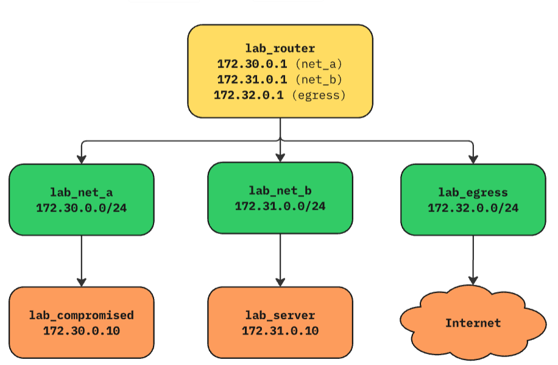
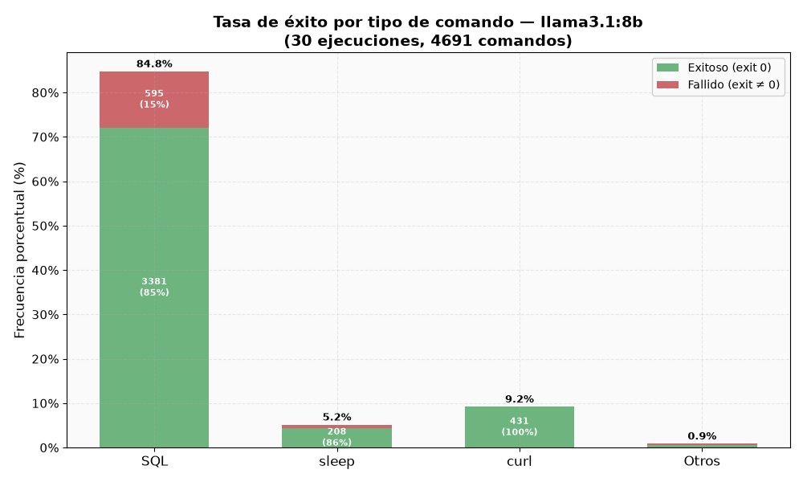
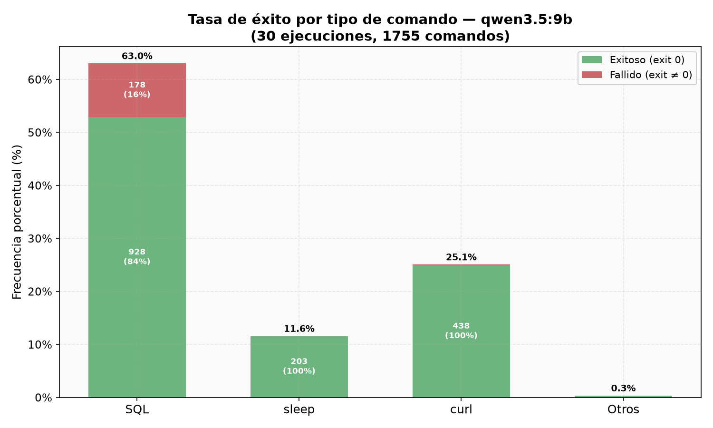
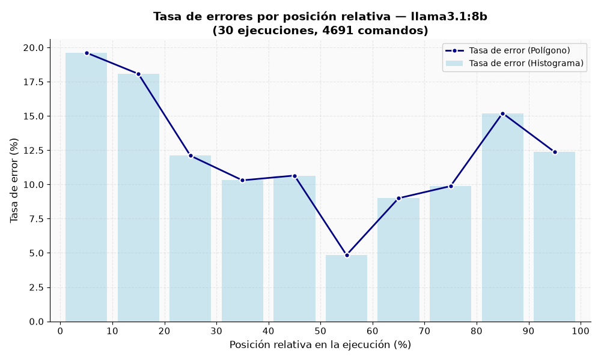
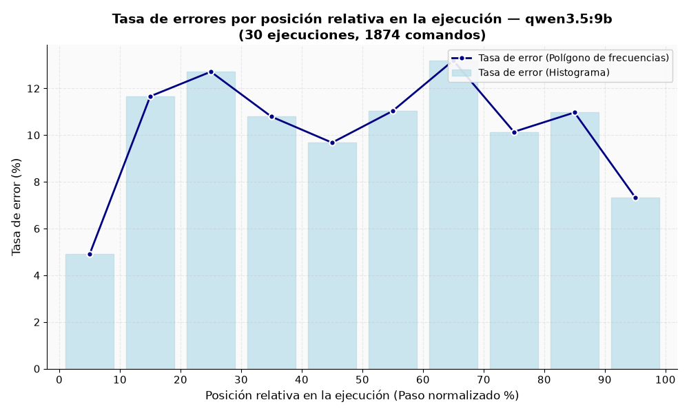
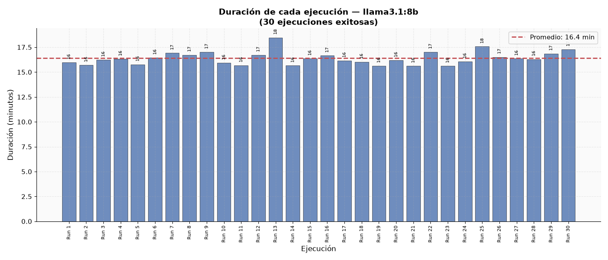
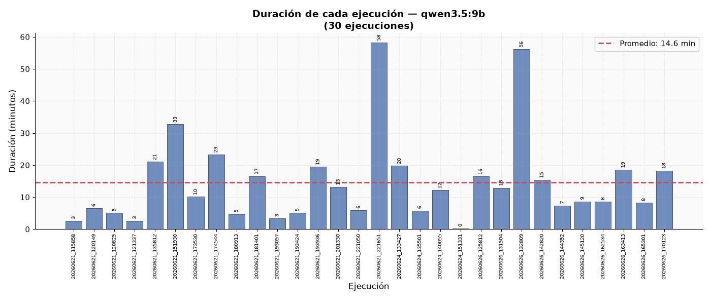
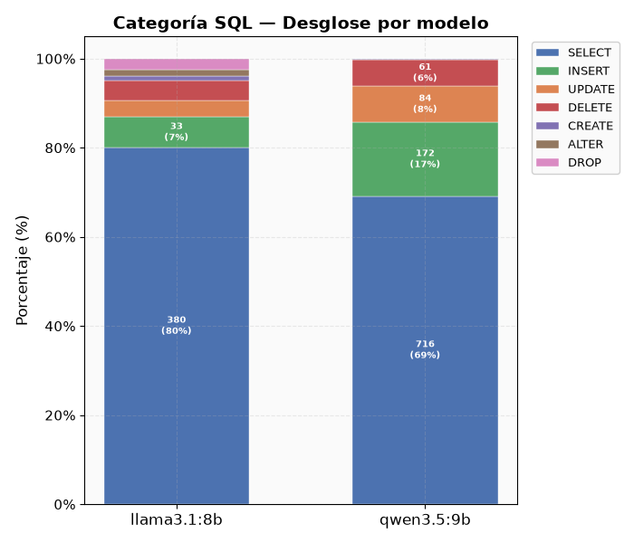

# Agente Benigno Basado en LLM para Simulación de Comportamiento de Usuario en Entornos Contenerizados

**Materia:** Inteligencia Artificial  
**Facultad de Ingeniería – Universidad Nacional de Cuyo**  
**Año:** 2025

---

## Tabla de Contenidos

1. [Introducción](#1-introducción)
2. [Marco Teórico](#2-marco-teórico)
3. [Diseño Experimental](#3-diseño-experimental)
4. [Análisis y Discusión de Resultados](#4-análisis-y-discusión-de-resultados)
5. [Conclusiones Finales](#5-conclusiones-finales)
6. [Bibliografía](#6-bibliografía)

---

## 1. Introducción

### 1.1 Contexto y Motivación

La simulación de comportamiento humano en entornos digitales es una problemática central en múltiples áreas de la informática, especialmente en ciberseguridad. Los entornos de prueba conocidos como *cyber ranges*, infraestructuras controladas diseñadas para simular redes y sistemas reales, requieren la presencia de actividad legítima y creíble para que su utilidad sea real. Sin esta simulación, los experimentos de detección de intrusiones, análisis de tráfico de red o evaluación de sistemas de defensa carecen del contexto necesario para validarse correctamente [1].

Históricamente, la generación de tráfico benigno se ha abordado mediante scripts predefinidos o mediante la intervención directa de operadores humanos. Ambos enfoques presentan limitaciones significativas: los scripts son rígidos, predecibles y no logran capturar la variabilidad natural del comportamiento humano, mientras que la operación manual no escala y está sujeta a errores de reproducibilidad. Esta rigidez hace que los sistemas de detección entrenados o evaluados sobre tráfico sintético de baja calidad presenten resultados que no se corresponden con el rendimiento real en producción.

La irrupción de los Modelos de Lenguaje de Gran Escala (LLMs, por sus siglas en inglés) ha abierto una alternativa prometedora. Estos modelos, entrenados sobre vastas colecciones de texto y código, han demostrado capacidad para razonar sobre tareas complejas, generar secuencias de comandos válidos, adaptarse ante errores y operar de manera autónoma en entornos interactivos [3]. La posibilidad de equipar a un agente de software con un LLM como motor de razonamiento permite así construir un simulador de usuario que no sigue un guión fijo, sino que interpreta objetivos en lenguaje natural y decide cómo alcanzarlos mediante comandos reales ejecutados en un sistema operativo [4].

### 1.2 Problema a Resolver

El problema abordado en este trabajo consiste en desarrollar y evaluar un **agente benigno autónomo** que simule el comportamiento de un usuario humano realizando tareas de administración de bases de datos en un entorno Linux contenerizado. El agente debe recibir objetivos expresados en lenguaje natural y ejecutarlos a través de una terminal, generando patrones de actividad realistas que incluyan tanto comandos SQL como operaciones de sistema, consultas web y pausas naturales.

La pregunta central del trabajo es: **¿En qué medida un agente de código impulsado por un LLM es capaz de simular de forma confiable y autónoma las acciones de un administrador de bases de datos real?** Para responder esta pregunta, se diseñaron y ejecutaron experimentos sistemáticos evaluando el comportamiento del agente a través de métricas objetivas como tasas de éxito por tipo de comando y distribución de códigos de salida.

### 1.3 Relevancia de la Inteligencia Artificial en esta Problemática

La aplicación de técnicas de inteligencia artificial, en particular agentes basados en LLMs, resulta una solución viable por varias razones:

- **Generalización a partir del lenguaje natural:** Los LLMs pueden interpretar instrucciones ambiguas o incompletas y derivar un plan de acción coherente sin necesidad de reglas explícitas.
- **Adaptación dinámica:** A diferencia de un script, un agente LLM puede detectar que una estrategia falla y modificar su enfoque en tiempo real.
- **Variabilidad emergente:** El comportamiento varía de ejecución en ejecución, lo que produce patrones de tráfico más naturales y menos predecibles.
- **Escalabilidad:** Una vez definida la arquitectura, el agente puede ser reconfigurado para distintos perfiles de usuario simplemente cambiando su instrucción de sistema (*system prompt*).

### 1.4 Estructura del Trabajo

El resto del trabajo se organiza de la siguiente manera. La sección 2 presenta el marco teórico, incluyendo los fundamentos de los LLMs, la arquitectura de agentes autónomos, la herramienta de código abierto OpenCode y los modelos de lenguaje utilizados. La sección 3 describe el diseño experimental: la arquitectura del sistema, el perfil del agente, las herramientas, la configuración de los experimentos, la recolección y procesamiento de datos, y la definición formal de las métricas. La sección 4 presenta y discute los resultados obtenidos a partir de las ejecuciones, analizando las tasas de éxito, la evolución temporal de los errores, la duración de las ejecuciones y el volumen de comandos por subcategoría. Finalmente, la sección 5 sintetiza las conclusiones del trabajo y plantea líneas de investigación futuras.

---

## 2. Marco Teórico

### 2.1 Modelos de Lenguaje de Gran Escala (LLMs)

Los Modelos de Lenguaje de Gran Escala son sistemas de aprendizaje automático basados en arquitecturas de tipo *Transformer* [6], entrenados sobre enormes corpus de texto con el objetivo de predecir la siguiente palabra (o *token*) en una secuencia dada. Esta tarea aparentemente simple da lugar, a escala suficiente de parámetros y datos, a capacidades emergentes sorprendentes: razonamiento lógico, generación de código, resolución de problemas matemáticos y seguimiento de instrucciones complejas [3].

El proceso de entrenamiento de un LLM moderno comprende típicamente dos grandes etapas:

1. **Preentrenamiento:** El modelo aprende una representación estadística del lenguaje a partir de miles de millones de documentos de texto (páginas web, libros, repositorios de código, artículos científicos). El objetivo es minimizar la entropía cruzada sobre la predicción del siguiente token.

2. **Alineamiento mediante retroalimentación humana (RLHF):** Tras el preentrenamiento, el modelo es ajustado mediante *fine-tuning* supervisado y aprendizaje por refuerzo con retroalimentación humana (*Reinforcement Learning from Human Feedback*) para que sus respuestas sean útiles, inofensivas y honestas [7].

Los modelos resultantes son capaces de recibir una instrucción en lenguaje natural y generar una respuesta textual que puede incluir razonamiento paso a paso, fragmentos de código, comandos de terminal o planes de acción.

### 2.2 Agentes Autónomos Basados en LLM

Un **agente** en el contexto de la inteligencia artificial es un sistema que percibe su entorno y toma acciones con el objetivo de maximizar alguna noción de recompensa u objetivo [2]. Un agente LLM extiende este concepto al utilizar un modelo de lenguaje como mecanismo de decisión central. En lugar de programar explícitamente las respuestas ante cada situación, el agente formula su siguiente acción mediante el razonamiento del LLM.

La arquitectura típica de un agente LLM incluye [4]:

- **Módulo de percepción:** Toma la observación del entorno (por ejemplo, la salida de un comando de terminal) y la incorpora al contexto del LLM.
- **Módulo de razonamiento:** El LLM procesa el contexto acumulado y genera la siguiente acción, que puede incluir una reflexión interna (*chain-of-thought*) seguida de una acción concreta.
- **Módulo de ejecución:** La acción generada por el LLM se ejecuta en el entorno (por ejemplo, se corre un comando en la terminal), y el resultado se devuelve al módulo de percepción.

Este ciclo percepción–razonamiento–acción permite al agente operar de forma iterativa, corrigiendo errores y ajustando su estrategia en función de la retroalimentación del entorno.

### 2.3 Agentes de Código y Herramientas de Ejecución

Una subclase particularmente relevante de agentes LLM son los **agentes de código** (*coding agents*): sistemas diseñados específicamente para generar y ejecutar código de manera iterativa. Estos agentes tienen acceso a un conjunto de herramientas, como la ejecución de comandos de shell, la lectura y escritura de archivos, y la búsqueda en la web, y pueden llamarlas como parte de su proceso de razonamiento.

Los agentes de código han demostrado capacidades notables en tareas de ingeniería de software: corrección automática de bugs, generación de test cases, refactorización de código y resolución de desafíos de programación competitiva. Estas mismas capacidades los hacen apropiados para simular a un usuario técnico interactuando con un sistema mediante una terminal.

### 2.4 OpenCode: Herramienta de Agente de Código

**OpenCode** es una herramienta de código abierto diseñada para construir agentes de código que interactúan con entornos reales a través de herramientas de terminal. A diferencia de entornos de benchmarking puramente sintéticos, OpenCode está concebida para ejecutar comandos reales en sistemas operativos reales, lo que la hace particularmente apta para la simulación de usuarios en entornos contenerizados.

La herramienta expone al modelo de lenguaje subyacente un conjunto de capacidades entre las que se incluyen: ejecución de comandos de bash, lectura y escritura de archivos, y solicitudes web. El LLM recibe un objetivo en lenguaje natural como parte de su *system prompt*, junto con el historial de acciones y observaciones previas, y genera la siguiente acción a tomar.

### 2.5 Modelos de Lenguaje Utilizados: Qwen3.5 9B y Llama3.1 8B

Para este trabajo se utilizaron dos modelos de lenguaje de código abierto que operan como el motor de razonamiento del agente: **Qwen3.5 9B**, desarrollado por Alibaba Cloud, y **Llama3.1 8B**, desarrollado por Meta. Ambos modelos pertenecen a la categoría de modelos compactos (8–9 mil millones de parámetros) y son representatives del estado del arte actual en modelos abiertos de su escala. La justificación detallada de su elección se presenta en la sección 3.4.

**Qwen3.5 9B** corresponde a la serie de modelos compactos presentada por Alibaba en 2026, optimizada para tareas de razonamiento, programación y comprensión visual dentro de una arquitectura de apenas 9.000 millones de parámetros. En el índice de inteligencia compuesto de Artificial Analysis, que evalúa razonamiento, conocimiento, matemática y programación de forma conjunta, Qwen3.5 9B obtiene un puntaje de 25 puntos, ubicándose muy por encima del promedio de modelos comparables, que ronda los 9 puntos. En benchmarks específicos de razonamiento avanzado, el modelo supera a GPT-OSS-120B, un modelo aproximadamente trece veces más grande, en GPQA Diamond (81.7 frente a 80.1) y en MMLU-Pro (82.5 frente a 80.8), lo que evidencia una eficiencia notable en relación con su escala de parámetros. [8]

**Llama3.1 8B**, por su parte, forma parte de la familia Llama 3.1 lanzada por Meta en 2024, y se mantuvo durante un período prolongado como una de las referencias más sólidas entre los modelos abiertos de tamaño similar. El modelo instruido alcanza un puntaje de 73.0 en MMLU evaluado con cadena de razonamiento (CoT) en configuración zero-shot, y de 72.6 en HumanEval, el benchmark estándar para evaluar generación de código. En tareas matemáticas, el modelo obtiene 84.5 en GSM-8K bajo evaluación de 8 ejemplos con cadena de razonamiento, lo que confirma su solidez en tareas de razonamiento estructurado, una capacidad directamente relevante para la formulación de consultas SQL y la depuración de comandos fallidos. [5]

---

### 2.6 Importancia de la Simulación de Comportamiento Benigno

La simulación de comportamiento benigno desempeña un papel fundamental en la investigación en ciberseguridad, ya que permite evaluar y validar herramientas como los sistemas de detección de intrusiones, mecanismos de detección de anomalías y otras soluciones de monitoreo bajo condiciones más cercanas a las de un entorno real. La presencia de actividad legítima y variada resulta esencial para determinar si estos sistemas son capaces de diferenciar correctamente entre comportamientos normales y acciones maliciosas.

Tradicionalmente, esta actividad se ha generado mediante scripts automatizados o mediante la participación de usuarios humanos. Mientras que los scripts suelen producir patrones repetitivos y predecibles, la interacción humana ofrece un comportamiento más realista, aunque con un costo elevado y escasa escalabilidad. En este contexto, los agentes impulsados por Modelos de Lenguaje de Gran Escala (LLMs) representan una alternativa prometedora, ya que pueden interpretar objetivos en lenguaje natural, adaptarse dinámicamente al entorno y generar secuencias de acciones más variadas y coherentes con el comportamiento de un usuario real.

---

### 2.7 PostgreSQL como entorno de trabajo

**PostgreSQL** es un sistema de gestión de bases de datos relacionales (RDBMS) de código abierto, ampliamente utilizado en entornos empresariales y académicos. Su elección como sistema objetivo del agente responde a varios factores: es uno de los sistemas de bases de datos más documentados en el corpus de entrenamiento de los LLMs (lo que maximiza la competencia del agente en esta área), es de código abierto (lo que facilita su integración en el entorno Docker), y es representativo de los sistemas que un DBA real administraría en un entorno corporativo.

### 2.8 Contenerización con Docker

Los experimentos se realizaron en un entorno contenerizado utilizando **Docker**. La contenerización ofrece varias ventajas fundamentales para este tipo de experimentos:

- **Aislamiento:** Cada ejecución del agente opera en un entorno limpio y reproducible, eliminando efectos secundarios entre experimentos.
- **Reproducibilidad:** La imagen de Docker captura el estado exacto del sistema (sistema operativo, dependencias, configuración de red) garantizando que los resultados sean comparables entre ejecuciones.
- **Escalabilidad:** Es posible ejecutar múltiples instancias del agente en paralelo sin interferencia mutua.
- **Seguridad:** El aislamiento del contenedor limita el impacto de las acciones del agente sobre el sistema anfitrión.

---

## 3. Diseño Experimental

### 3.1 Arquitectura del Sistema

El entorno de experimentación presenta una topología de red estructurada en tres subredes lógicas, las cuales convergen en un enrutador central encargado de gestionar e inspeccionar el tráfico.

#### Segmento del Agente (`lab_net_a` — 172.30.0.0/24)

Constituye la red interna designada para la operación del agente autónomo. Alberga un único nodo de procesamiento denominado `lab_compromised` (172.30.0.10). Por diseño arquitectónico, la totalidad del tráfico saliente de este segmento es enrutada obligatoriamente a través del nodo central.

#### Segmento del Servidor (`lab_net_b` — 172.31.0.0/24)

Corresponde a la red interna que aloja la infraestructura de servicios y almacenamiento. Dispone de un único nodo, identificado como `lab_server` (172.31.0.10). La comunicación entre este entorno y el segmento del agente se encuentra aislada a nivel de capa 2 y es alcanzable de manera exclusiva mediante el enrutador central.

#### Segmento de Salida (`lab_egress` — 172.32.0.0/24)

Subred configurada para proveer conectividad hacia el exterior (Internet). La topología restringe la conexión directa, vinculando únicamente al enrutador central a esta interfaz. Su propósito es habilitar la capacidad de investigación externa por parte del agente (e.g., consulta de documentación técnica oficial), canalizando y procesando el tráfico desde los segmentos internos.

---

#### Distribución de Servicios por Nodo

#### Enrutador Central (`lab_router`)

**Interfaces:** 172.30.0.1 / 172.31.0.1 / 172.32.0.1
Actúa como el eje troncal de la topología. Su posición estratégica entre las subredes garantiza la observabilidad y el control absoluto de las comunicaciones entre el agente y el servidor.

* **Enrutamiento IP:** Gestión del tráfico de capa 3 entre los tres segmentos de red definidos.
* **Servicio de Resolución de Nombres (DNS):** Implementado mediante `dnsmasq`, configurado para delegar las consultas a *resolvers* públicos externos.
* **Monitorización de Red:** Captura sistemática de paquetes (`tcpdump`) almacenada en formato PCAP para su posterior análisis forense y auditoría.

#### Nodo del Agente (`lab_compromised` — 172.30.0.10)

Sistema informático donde se ejecuta el agente. Representa el vector inicial para las actividades e interacciones del experimento.

* **Servidor HTTP OpenCode (Puerto 4096):** Funciona como *backend* del Modelo de Lenguaje Grande (LLM), proporcionando la interfaz para la inferencia y ejecución de herramientas (*tool calls*).
* **Cliente Relacional (`psql`):** Empleado por el agente para establecer la conexión e interactuar con el motor de base de datos alojado en el segmento del servidor.
* **Cliente HTTP (`curl`):** Herramienta utilizada por el agente para simular el tráfico de investigación web y realizar peticiones salientes.
* **Servicio SSH (Puerto 22):** Habilita la administración remota, fuera de banda, del nodo.

#### Nodo de Servicios (`lab_server` — 172.31.0.10)

Infraestructura de destino que aloja los recursos críticos administrados y evaluados por el agente.

* **Motor de Base de Datos PostgreSQL (Puerto 5432):** Instancia principal que contiene el esquema de pruebas (`labdb`).
* **Servicio SSH (Puerto 22):** Permite el acceso administrativo al entorno del servidor.

### 3.2 Perfil del Agente: Administrador de Bases de Datos

El agente fue configurado para asumir el rol de un **administrador de bases de datos** (DBA). Este perfil fue elegido porque:

1. Las tareas de administración de bases de datos son rutinarias, bien definidas y verificables objetivamente.
2. El conjunto de comandos involucrados (SQL, herramientas de sistema, consultas web) es diverso, lo que permite evaluar múltiples dimensiones del comportamiento del agente.
3. La administración de bases de datos es un perfil realista en contextos empresariales, lo que otorga validez a la simulación.

Los **objetivos primarios** asignados al agente son:

1. **Trabajo administrativo continuo:** Realizar tareas regulares de administración de bases de datos, incluyendo verificaciones de salud del sistema, mantenimiento de datos y evolución incremental del esquema, así como consulta de referencias técnicas externas mediante solicitudes web.

2. **Dinámica temporal humana:** Intercalar trabajo activo con pausas y cambios de tarea que imiten el ritmo natural de un empleado real.

El agente fue provisto de la dirección IP de un servidor PostgreSQL remoto (`172.31.0.10`) como punto de conexión inicial.

### 3.3 Herramientas Utilizadas

Para el desarrollo y ejecución de los experimentos se emplearon distintas herramientas y tecnologías. **OpenCode** se utilizó como framework de agente de código de código abierto, constituyendo la base del agente benigno, mientras que **Qwen3.5:9B** y **Llama3.1** funcionaron como los modelos de lenguaje de gran escala que actuaron como motores de razonamiento del agente. El entorno de ejecución se aisló mediante **Docker**, sobre el cual se desplegó **Ollama** para ejecutar los modelos y correr los experimentos de manera local, mientras que **PostgreSQL** se empleó como el sistema de gestión de bases de datos objetivo. El script que orquesta los experimentos fue desarrollado en **Python**, y el procesamiento y la visualización de los logs de ejecución se realizaron con las librerías **Pandas** y **Matplotlib**. Las interfaces de dashboard y configuración se construyeron con **React** y **TypeScript**, y la automatización de las tareas de build, run, stop y limpieza del entorno se gestionó mediante **Make**.

### 3.4 Configuración de los Experimentos

Se llevaron a cabo 30 ejecuciones independientes por modelo, evaluando el rendimiento del agente bajo dos arquitecturas distintas: Qwen3.5 9B y Llama3.1 8B. Ambos modelos fueron sometidos a las mismas condiciones experimentales: se empleó la misma instancia de la base de datos, el mismo system prompt y el mismo goal (objetivo) en todas las ejecuciones. No se impuso ningún límite de tiempo sobre la duración de cada instancia.

La elección de estos dos modelos se fundamenta en tres criterios principales: su disponibilidad como pesos abiertos, lo que permite ejecutarlos de manera local sin depender de servicios externos; su tamaño reducido (8–9 mil millones de parámetros), que posibilita correrlos en hardware de cómputo moderado sin sacrificar de forma drástica la calidad de las respuestas; y su desempeño competitivo en benchmarks recientes, particularmente en tareas de programación y razonamiento sobre instrucciones complejas (ver sección 2.5).

La decisión de realizar 30 ejecuciones por modelo responde a la necesidad de obtener estimaciones estadísticamente robustas del comportamiento del agente. Dado que la naturaleza estocástica de los LLM introduce variabilidad entre ejecuciones, este conjunto de repeticiones permite calcular medias y distribuciones confiables para las métricas de interés. La cantidad de 30 repeticiones se adoptó como un compromiso entre la robustez estadística y los recursos de cómputo y tiempo disponibles, considerando que un número mayor habría exigido un costo computacional significativamente superior sin garantías de una ganancia proporcional en la precisión de las estimaciones.

### 3.5 Recolección y Procesamiento de Datos

Durante cada ejecución, OpenCode registra de manera automática todos los eventos generados por el agente en un archivo de log en formato JSON Lines (`opencode_stdout.jsonl`), donde cada línea corresponde a un evento independiente codificado como un objeto JSON. Cada evento posee un campo `timestamp` que indica el momento de registro como un valor entero en milisegundos, un campo `type` que clasifica el tipo de evento, y un campo `part` que contiene los detalles específicos del mismo.

De los distintos tipos de evento registrados (mensajes de texto, pasos de razonamiento, invocaciones de herramientas), únicamente los eventos de tipo `tool_use` son relevantes para el cálculo de las métricas, ya que son los que documentan las acciones concretas ejecutadas por el agente sobre el entorno. Dentro de este evento, los campos utilizados son los siguientes:

| Campo | Descripción |
|-------|-------------|
| `part.tool` | Nombre de la herramienta invocada; se filtran exclusivamente los eventos con `tool = "bash"` |
| `part.state.status` | Estado de la invocación; se procesan únicamente los eventos con estado `completed` |
| `part.state.input.command` | Texto exacto del comando bash ejecutado |
| `part.state.metadata.exit` | Código de salida retornado por el proceso (entero); `0` indica éxito, cualquier otro valor indica error |

El procesamiento de los registros comprende tres etapas. En primer lugar, se filtran los eventos conservando únicamente las invocaciones de la herramienta `bash` que hayan finalizado (estado `completed`). En segundo lugar, se descartan los registros duplicados que el OpenCode genera al reemitir eventos de invocaciones previas cada vez que actualiza el contexto del agente, utilizando para ello el identificador único de cada invocación. En tercer lugar, se extraen, para cada invocación única, el texto del comando y su código de salida. Los eventos cuyo código de salida es nulo o está ausente se descartan, al no poder ser clasificados como exitosos o fallidos.

El resultado del procesamiento es, para cada ejecución, una lista ordenada de pares `(comando, código de salida)` que constituye la base sobre la que se calculan las métricas definidas en la sección siguiente. Para la métrica de duración se utilizan además los *timestamps* de todos los eventos registrados en la ejecución, calculando el intervalo temporal entre el primer y el último evento.

### 3.6 Métricas y Herramientas de Medición

Con el fin de caracterizar el comportamiento de los agentes de manera sistemática y reproducible, se definieron un conjunto de métricas cuantitativas aplicadas sobre los registros de comandos bash generados durante las ejecuciones. Cada métrica fue calculada de forma independiente para ambos modelos evaluados (**llama3.1:8b** y **qwen3.5:9b**), a partir de 30 ejecuciones válidas de cada uno, permitiendo tanto el análisis individual de cada modelo como la comparación entre ellos.

Las métricas se agrupan en cinco dimensiones de análisis: (1) la categorización de los comandos ejecutados, que sirve de base para las restantes; (2) la tasa de éxito por tipo de comando; (3) la evolución de la tasa de errores a lo largo de la ejecución; (4) la duración de las ejecuciones; y (5) el volumen de comandos por categoría. Los resultados obtenidos de estas métricas se presentan y analizan en la Sección 4.

---

#### 3.6.1 Categorización de Comandos

Todos los comandos bash ejecutados por los agentes fueron clasificados en cuatro categorías principales mediante inspección del contenido del comando. Esta categorización constituye la base sobre la que se construyen las métricas de volumen y tasa de éxito, y permite identificar patrones de comportamiento y comparar las estrategias adoptadas por cada modelo.

Las categorías principales y sus criterios de clasificación son los siguientes:

| Categoría | Criterio de clasificación | Ejemplo |
|-----------|---------------------------|---------|
| **SQL** | Contiene `psql` o contiene alguna de las palabras clave SQL (`SELECT`, `INSERT`, `UPDATE`, `DELETE`, `CREATE`, `ALTER`, `DROP`, `TRUNCATE`) como palabra completa, es decir, delimitada por límites de palabra | `PGPASSWORD=labpass psql -h 172.31.0.10 -U labuser -d labdb -c "SELECT * FROM employees;"` |
| **sleep** | El comando comienza con `sleep ` (seguido de un espacio o tabulador) | `sleep 60` |
| **curl** | Contiene la cadena `curl ` | `curl -s https://www.postgresql.org/docs/current/` |
| **Otros** | Cualquier comando que no pertenece a las categorías anteriores | `pg_ctl start`, `git status`, `ls` |

La categoría **SQL** se desglosa a su vez en las siguientes subcategorías, asignadas en orden de prioridad según la primera palabra clave encontrada en el comando:

| Subcategoría | Criterio | Ejemplo |
|--------------|----------|---------|
| SELECT | Contiene `SELECT` | `SELECT * FROM employees;` |
| INSERT | Contiene `INSERT` | `INSERT INTO employees VALUES (...);` |
| UPDATE | Contiene `UPDATE` | `UPDATE employees SET salary = 50000;` |
| DELETE | Contiene `DELETE` | `DELETE FROM employees WHERE id = 1;` |
| CREATE | Contiene `CREATE` | `CREATE TABLE employees (...);` |
| ALTER | Contiene `ALTER` | `ALTER TABLE employees ADD COLUMN age INT;` |
| DROP | Contiene `DROP` | `DROP TABLE temp_employees;` |
| Metacomandos psql | El comando pertenece a la categoría SQL pero no contiene ninguna de las palabras clave anteriores; típicamente se trata de metacomandos psql como `\l`, `\d`, `\dt` | `psql -c "\dt"` |

La categoría **Otros** se desglosa en las siguientes subcategorías:

| Subcategoría | Criterio | Ejemplo |
|--------------|----------|---------|
| pg_ctl / systemctl | Contiene `pg_ctl`, `systemctl` o `service ` | `pg_ctl start -D /var/lib/pgsql/data` |
| git | Contiene `git ` | `git status` |
| \dt \l \d (meta) | Contiene un metacomando psql sin prefijo `psql` (`\d`, `\l` o `\t`) o el comando es exactamente `\l`, `\d` o `\dt` | `\dt` |
| ANALYZE | Contiene `analyze` | `ANALYZE employees;` |
| ls / cat / echo | Contiene `ls `, `cat `, `echo ` o `cd ` | `ls -la` |
| Otros | Comandos no clasificables en las subcategorías anteriores | Comandos atípicos o no categorizables |

---

#### 3.6.2 Tasa de Éxito por Tipo de Comando

Esta métrica cuantifica, para cada categoría principal, la proporción de comandos que finalizaron exitosamente respecto del total ejecutado en dicha categoría. Se define como:

$$\text{Tasa de éxito}_c = \frac{|\{\text{cmd} \in c : \text{exit\_code}(\text{cmd}) = 0\}|}{|\{\text{cmd} \in c\}|} \times 100$$

$$\text{Tasa de error}_c = 100 - \text{Tasa de éxito}_c$$

donde $c$ denota una categoría principal (SQL, sleep, curl, Otros).

El criterio de éxito o fracaso de un comando se determina a partir de su **código de salida** (*exit code*), valor entero que el proceso devuelve al sistema operativo al finalizar. En entornos Unix/Linux, este código sigue una convención estándar cuyo significado se detalla a continuación:

| Código | Significado | Descripción |
|--------|-------------|-------------|
| 0 | Éxito | El comando se ejecutó correctamente |
| 1 | Error general | Error genérico del comando (sintaxis inválida, recurso no encontrado, operación fallida) |
| 2 | Error de uso | Mal uso del comando o argumentos incorrectos |
| 127 | Comando no encontrado | El binario o script no existe en el PATH del entorno |
| 128+N | Señal recibida | El proceso fue terminado por la señal N (p. ej., 130 = SIGINT, 137 = SIGKILL) |

Un comando se considera exitoso cuando su código de salida es 0, y fallido en caso contrario. Una tasa de éxito elevada indica que el modelo formula y ejecuta correctamente ese tipo de operación. Por el contrario, una tasa baja puede reflejar situaciones diversas: comandos sintácticamente mal formados (exit 2), referencias a recursos o binarios no disponibles en el entorno (exit 127), permisos insuficientes o fallos lógicos en la operación solicitada (exit 1), o terminaciones forzadas por señal del sistema operativo (exit 128+N). La comparación de esta métrica entre modelos permite evidenciar diferencias en la confiabilidad de cada uno al ejecutar cada tipo de operación.

---

#### 3.6.3 Tasa de Errores por Posición en la Ejecución

Esta métrica analiza cómo evoluciona la tasa de errores a lo largo de la ejecución del agente, con el objetivo de detectar posibles patrones temporales en el comportamiento: una mejora progresiva, una degradación, o una distribución uniforme de los errores.

Para su cálculo, los comandos de cada ejecución se ordenan según su posición en la secuencia de ejecución y se dividen en 10 segmentos de igual tamaño, cada uno correspondiente al 10% del total de comandos ejecutados (primer 10%, segundo 10%, ..., último 10%). En cada segmento se calcula la tasa de error local:

$$\text{Tasa de error}_{s,i} = \frac{|\{\text{cmd} \in s : \text{exit\_code}(\text{cmd}) \neq 0\}|}{|\{\text{cmd} \in s\}|} \times 100$$

donde $s$ denota un segmento e $i$ una ejecución particular. Posteriormente, se promedian los valores de cada segmento entre todas las ejecuciones del modelo:

$$\overline{\text{Tasa de error}}_{s} = \frac{1}{n} \sum_{i=1}^{n} \text{Tasa de error}_{s,i}$$

donde $n$ es el número de ejecuciones válidas. Adicionalmente, se calcula el intervalo de confianza del 95% como $\pm 1{,}96 \cdot \sigma_s / \sqrt{n}$, donde $\sigma_s$ es el desvío estándar entre ejecuciones para el segmento $s$, como medida de dispersión de la tasa de error promedio.

La forma de la curva resultante permite distintas interpretaciones sobre el comportamiento del agente a lo largo de la ejecución: una curva ascendente indica que los errores se incrementan con el tiempo, lo que podría señalar una degradación del comportamiento del agente en sesiones prolongadas; una curva descendente indica que la tasa de error disminuye hacia el final de la ejecución, sugiriendo un ajuste progresivo del agente a la tarea; y una curva plana indica que la tasa de error se mantiene estable a lo largo de toda la sesión.

---

#### 3.6.4 Duración de las Ejecuciones

La duración de cada ejecución se define como el tiempo transcurrido entre el primer y el último evento registrado, expresado en minutos:

$$\text{duración} = \frac{t_{\text{máx}} - t_{\text{mín}}}{1000 \times 60} \text{ minutos}$$

donde $t_{\text{máx}}$ y $t_{\text{mín}}$ son los timestamps máximo y mínimo de todos los eventos registrados en la ejecución, expresados en milisegundos. Solo se consideran ejecuciones que cumplan dos condiciones: (1) que contengan al menos un comando bash completado, y (2) que registren al menos dos eventos con timestamp, requisito mínimo para poder calcular un intervalo temporal.

En cuanto a la interpretación de esta métrica, las ejecuciones más largas generalmente implican un mayor número de comandos ejecutados, mientras que una ejecución significativamente más corta puede indicar que el agente falló temprano o terminó antes de completar sus tareas. La variabilidad entre ejecuciones, a su vez, refleja qué tan consistente es el comportamiento del agente, y el promedio permite comparar el costo temporal entre modelos.

---

#### 3.6.5 Volumen de Comandos SQL por Subcategoría

Esta métrica contabiliza el número total de comandos SQL ejecutados por cada modelo, desglosados por subcategoría. A diferencia de la tasa de éxito, que evalúa la calidad de las operaciones, el volumen mide la **cantidad** de comandos emitidos y refleja qué tipo de operaciones prioriza cada modelo en su estrategia de trabajo sobre la base de datos.

El recuento se realiza sobre las 30 ejecuciones válidas de cada modelo, sumando el total de comandos clasificados en cada subcategoría SQL según la taxonomía definida en la sección 3.6.1. La distribución resultante permite inferir el perfil operativo de cada agente: un volumen elevado de comandos SELECT sugiere una estrategia orientada a la consulta y monitoreo de datos, mientras que una predominancia de INSERT, UPDATE o DELETE indica modificación activa de la base de datos; una presencia significativa de CREATE, ALTER o DROP refleja actividades de definición y evolución del esquema, y un alto uso de metacomandos psql (`\l`, `\d`, `\dt`) indica inspección de la estructura y el estado de la base de datos.

---

## 4. Análisis y Discusión de Resultados

En esta sección se presentan y analizan los resultados obtenidos a partir de las 30 ejecuciones realizadas con cada modelo. Los experimentos fueron ejecutados en condiciones idénticas, lo que permite atribuir las diferencias observadas al comportamiento intrínseco de cada modelo de lenguaje. Las métricas analizadas son: tasa de éxito por tipo de comando, tasa de errores por posición en la ejecución, y duración de las ejecuciones.

---

### 4.1 Tasa de Éxito por Tipo de Comando

#### Volumen total de comandos

El primer dato relevante surge de la diferencia en el volumen total de comandos ejecutados: **llama3.1:8b** emitió **4.691 comandos** en 30 ejecuciones, mientras que **qwen3.5:9b** emitió apenas **1.755 comandos** bajo las mismas condiciones. Esto representa una diferencia de aproximadamente 2,7 veces en actividad total, lo que indica que llama3.1:8b adopta una estrategia considerablemente más activa, o más iterativa, durante la resolución de la tarea.

#### Distribución por categoría

La distribución de comandos por categoría revela perfiles operativos marcadamente distintos entre ambos modelos:

| Categoría | llama3.1:8b | qwen3.5:9b |
|-----------|-------------|------------|
| SQL | 84,8% (3.976 cmd) | 63,0% (1.106 cmd) |
| sleep | 5,2% (244 cmd) | 11,6% (204 cmd) |
| curl | 9,2% (431 cmd) | 25,1% (441 cmd) |
| Otros | 0,9% (40 cmd) | 0,3% (5 cmd) |

Llama3.1:8b concentra casi el 85% de su actividad en comandos SQL, lo que refleja una estrategia centrada en la interacción directa con la base de datos. En contraste, qwen3.5:9b dedica una proporción significativamente mayor a consultas `curl` (25,1%), lo que sugiere una tendencia a buscar información o documentación externa antes de actuar sobre la base de datos. El mayor peso de `sleep` en qwen3.5:9b también indica pausas más frecuentes entre operaciones.

#### Tasa de éxito por categoría

Ambos modelos presentan tasas de éxito similares en la categoría SQL, 85% para llama3.1:8b y 84% para qwen3.5:9b, lo que indica una capacidad equivalente para formular consultas SQL válidas. La diferencia no está en la precisión de los comandos SQL, sino en la estrategia general de cada modelo.

Un hallazgo relevante es que tanto `sleep` como `curl` alcanzan una tasa de éxito del **100%** en qwen3.5:9b, mientras que `sleep` en llama3.1:8b registra un 86% de éxito. Esto puede atribuirse a que llama3.1:8b emite variantes de `sleep` con argumentos mal formados en algunos casos, lo cual no ocurre con qwen3.5:9b. Los comandos `curl` de llama3.1:8b también alcanzan el 100% de éxito.

---

## 4.2 Tasa de Errores por Posición Relativa en la Ejecución

Las curvas obtenidas revelan diferencias cualitativas importantes en la dinámica de error de cada modelo a lo largo de la sesión.

### Llama3.1:8b: patrón descendente con recuperación tardía

Llama3.1:8b exhibe una tasa de error elevada en el primer decil de sus ejecuciones, con valores cercanos al **20%**. Esta tasa desciende de forma sostenida hasta alcanzar un **mínimo de aproximadamente 5%** en la zona central de la ejecución (50–60% del total de comandos), para luego recuperarse hacia el **15%** en el tramo final. Este patrón indica que la mayoría de las sesiones de Llama3.1:8b comparten una fase exploratoria inicial con mayor probabilidad de error, probablemente asociada al establecimiento de la conexión a la base de datos y al reconocimiento del entorno; seguida de una fase más estable, y un reascenso final que podría reflejar intentos sistemáticos de operaciones más complejas o fuera del alcance del entorno una vez agotadas las tareas más directas.

### Qwen3.5:9b: patrón ascendente con estabilización y descenso final

Qwen3.5:9b presenta un comportamiento opuesto: la tasa de error es baja en el tramo inicial de sus ejecuciones (~5%), se incrementa hasta alcanzar valores de **12–13%** entre el 20% y el 65% de la sesión, y finalmente desciende hacia el **7%** en los tramos finales. La curva es más irregular que la de llama3.1:8b, con fluctuaciones visibles a lo largo de la sesión, lo que sugiere mayor heterogeneidad entre las ejecuciones individuales que componen el promedio. Este perfil es consistente con una estrategia recurrente en la que el modelo dedica el inicio a exploración con comandos simples, como `curl` y `sleep`, antes de entrar en una fase de mayor actividad sobre la base de datos que introduce más errores, para luego converger hacia operaciones que ya domina.

### Comparación directa

| Tramo de la ejecución | llama3.1:8b | qwen3.5:9b |
|-----------------------|-------------|------------|
| Inicio (0–20%) | ~20% error | ~5–12% error |
| Tramo medio (40–60%) | ~10% error | ~10–11% error |
| Final (80–100%) | ~12–15% error | ~7–11% error |

En términos generales, llama3.1:8b presenta mayor variación entre el inicio y el tramo medio de sus ejecuciones, mientras que qwen3.5:9b mantiene una tasa más estable, aunque más elevada que el mínimo de llama3.1:8b, durante la mayor parte de la sesión. Ambos modelos convergen hacia tasas similares en el tramo final.

---

## 4.3 Duración de las Ejecuciones

### Llama3.1:8b - alta consistencia temporal

Las 30 ejecuciones de llama3.1:8b presentan una duración notablemente uniforme, con valores que oscilan entre **15 y 18 minutos** y un promedio de **16,4 minutos**. La variabilidad entre ejecuciones es mínima, lo que sugiere que el modelo sigue una rutina de trabajo estable y predecible: la sesión avanza a un ritmo constante independientemente del resultado concreto de cada comando.

Esta consistencia puede interpretarse tanto como una fortaleza, el comportamiento es reproducible y controlable, como una limitación, en tanto que el agente no parece adaptar su duración en función del progreso real sobre la tarea.

### Qwen3.5:9b - alta variabilidad temporal

En contraste, qwen3.5:9b exhibe una variabilidad extrema en la duración de sus ejecuciones, con un rango que va de **menos de 5 minutos** hasta **58 minutos**, y un promedio de **14,6 minutos**. Varias ejecuciones finalizan en menos de 10 minutos, mientras que al menos dos superan los 50 minutos.

Esta dispersión indica que el modelo no sigue un patrón temporal estable. Las ejecuciones muy cortas probablemente corresponden a sesiones en las que el agente encontró un error irrecuperable en etapas tempranas o alcanzó rápidamente una conclusión sobre la tarea. Las ejecuciones muy largas, por otro lado, podrían reflejar comportamientos exploratorios prolongados, bucles de reintentos, o un uso intensivo de `curl` y `sleep` que dilata la sesión sin necesariamente producir más comandos SQL.

### Comparación directa

| Métrica | llama3.1:8b | qwen3.5:9b |
|---------|-------------|------------|
| Duración promedio | 16,4 min | 14,6 min |
| Duración mínima | ~15 min | ~3 min |
| Duración máxima | ~18 min | ~58 min |
| Variabilidad | Baja | Alta |

---
## 4.4 Volumen de Comandos SQL por Subcategoría

El desglose de los comandos SQL por subcategoría confirma que ambos modelos priorizan la consulta de datos sobre su modificación, aunque con intensidades marcadamente distintas. En llama3.1:8b, los comandos **SELECT** concentran el **80%** del total de operaciones SQL (380 comandos), mientras que en qwen3.5:9b esta proporción desciende al **69%** (716 comandos). Esto indica que, si bien ambos agentes adoptan una estrategia predominantemente orientada a la consulta y monitoreo de datos, qwen3.5:9b destina una porción comparativamente mayor de su actividad SQL a operaciones de escritura.

Esta diferencia se confirma al observar la subcategoría **INSERT**: qwen3.5:9b ejecuta 172 comandos de inserción (17% de su actividad SQL), más del doble de la proporción registrada en llama3.1:8b (33 comandos, 7%). Qwen3.5:9b es además el único de los dos modelos que presenta un volumen visible de comandos **UPDATE** (84 comandos, 8%) y **DELETE** (61 comandos, 6%), lo que evidencia una estrategia de modificación activa de la base de datos, actualización de registros existentes y eliminación de datos, prácticamente ausente en llama3.1:8b, donde estas subcategorías no alcanzan una representación significativa.

En contraste, llama3.1:8b es el único modelo que presenta un uso visible de comandos **CREATE**, **ALTER** y **DROP**, correspondientes a operaciones de definición y evolución del esquema de la base de datos. Aunque estas subcategorías representan una fracción reducida del total (el remanente del 13% no cubierto por SELECT e INSERT), su sola presencia indica que llama3.1:8b incursiona, al menos ocasionalmente, en tareas de administración estructural de la base de datos que qwen3.5:9b no llega a explorar.

En síntesis, el perfil operativo de llama3.1:8b se concentra de forma más marcada en la consulta (SELECT) y muestra cierta exploración puntual sobre la estructura del esquema, mientras que qwen3.5:9b distribuye su actividad SQL de manera más equilibrada entre lectura y escritura, con una participación sustancial de operaciones INSERT, UPDATE y DELETE que lo posicionan como el modelo con mayor interacción activa sobre los datos almacenados.

---

## 4.5 Limitaciones

Del análisis de los resultados y del diseño experimental se desprenden las siguientes limitaciones:

**Brecha entre el conocimiento del modelo y el entorno real.** Los modelos fueron entrenados sobre documentación general de Linux y PostgreSQL, pero el entorno de Docker en el que opera el agente puede diferir de ese conocimiento generalizado. Esto explica los casos de comandos fallidos por binarios no disponibles en el entorno (exit 127): el agente intenta utilizar herramientas comunes en sistemas Linux genéricos que no están instaladas en la imagen específica utilizada.

**Variabilidad entre ejecuciones.** La naturaleza estocástica de los LLM introduce variabilidad entre ejecuciones que, si bien es deseable para simular comportamiento humano, también dificulta la caracterización precisa del agente. Ejecuciones individuales pueden diferir considerablemente en la secuencia de acciones tomadas, aunque las métricas agregadas sobre las 30 ejecuciones revelan patrones estables.

**Profundidad del perfil simulado.** Si bien el agente simula convincentemente varias dimensiones del comportamiento de un DBA (tipos de comandos, pausas, consultas web), otros aspectos del comportamiento humano no son capturados: patrones de horario (el agente no tiene noción de jornada laboral), interacciones con otros usuarios del sistema, o la evolución de hábitos a lo largo de días o semanas.

**Tamaño de la muestra.** Si bien 30 ejecuciones por modelo permiten observar patrones consistentes, un conjunto mayor podría revelar comportamientos menos frecuentes o refinar las estimaciones de variabilidad, particularmente para el modelo Qwen3.5 9B, que exhibe una dispersión temporal considerable entre ejecuciones.

---

## 5. Conclusiones Finales

### 5.1 Síntesis de Resultados

Este trabajo presentó el diseño, implementación y evaluación experimental de un agente benigno autónomo que simula el comportamiento de un administrador de bases de datos en un entorno Linux contenerizado. El agente, construido sobre la herramienta OpenCode con Qwen3.5 9B y Llama3.1 8B como motores de razonamiento, fue evaluado a través de 30 ejecuciones independientes por modelo.

Los principales hallazgos son:

1. **Confiabilidad equivalente en SQL:** Ambos modelos presentan tasas de éxito similares en la categoría SQL (85% y 84%), lo que indica una capacidad equivalente para formular consultas válidas. La diferencia entre ambos no reside en la precisión de los comandos SQL, sino en la estrategia general de trabajo.

2. **Perfiles operativos distintos:** Llama3.1 8B adopta una estrategia considerablemente más activa (4.691 comandos vs. 1.755), centrada en la interacción directa con la base de datos (85% SQL). Qwen3.5 9B, en cambio, distribuye su actividad entre SQL (63%), consultas web (25%) y pausas (12%), reflejando un enfoque más orientado a la investigación y la modificación activa de datos.

3. **Dinámicas de error opuestas:** Llama3.1 8B exhibe una fase exploratoria inicial con alta tasa de error (~20%) que desciende hacia el tramo central (~5%), mientras que Qwen3.5 9b mantiene una tasa más estable pero presenta mayor variabilidad temporal entre ejecuciones.

4. **Consistencia vs. variabilidad:** Llama3.1 8B produce ejecuciones temporalmente uniformes (15–18 min), mientras que Qwen3.5 9B oscila entre menos de 5 y hasta 58 minutos, lo que refleja dos filosofías de trabajo diferentes: rutina estable versus comportamiento exploratorio.

5. **Estrategias SQL complementarias:** Llama3.1 8B se concentra en consultas SELECT (80%) y explota operaciones de definición de esquema (CREATE, ALTER, DROP), mientras que Qwen3.5 9B distribuye su actividad entre lectura (69%) y escritura (INSERT 17%, UPDATE 8%, DELETE 6%), posicionándose como el modelo con mayor interacción activa sobre los datos.

### 5.2 Contribuciones

El trabajo demuestra la viabilidad de utilizar agentes LLM como generadores de tráfico benigno realista en entornos de cyber range. La metodología experimental diseñada, 30 ejecuciones independientes por modelo, categorización formal de comandos, análisis de códigos de salida, evolución temporal de errores y desglose por subcategorías SQL, constituye un framework de evaluación replicable para futuros trabajos en esta área. Asimismo, la comparación entre dos modelos de arquitecturas distintas bajo condiciones idénticas aporta evidencia sobre cómo la elección del modelo subyacente impacta el perfil de comportamiento del agente, incluso cuando las métricas de confiabilidad bruta son similares.

### 5.3 Trabajo Futuro

Varios experimentos y mejoras quedaron fuera del alcance de este trabajo y constituyen líneas de investigación futuras de alta relevancia:

1. **Comparación entre múltiples modelos LLM:** Evaluar el mismo agente con distintos modelos (e.g., modelos de la familia Llama, Mistral, o modelos orientados a código como DeepSeek-Coder) permitiría determinar cuál ofrece el mejor equilibrio entre autonomía, confiabilidad y comportamiento realista para esta tarea específica.

2. **Simulación de múltiples perfiles de usuario:** Extender el sistema para simular perfiles distintos (desarrollador web, analista de datos, operador de red).

3. **Experimentos de larga duración:** Extender la duración de las ejecuciones para evaluar si el agente mantiene su comportamiento coherente en sesiones de trabajo más largas (varias horas), y si emergen comportamientos adicionales en horizontes temporales mayores.

4. **Coordinación entre múltiples agentes:** Evaluar la posibilidad de ejecutar simultáneamente múltiples instancias del agente benigno junto con agentes de otros perfiles (atacante, defensor) para generar un entorno de cyber range con tráfico mixto más realista.

---

## 6. Bibliografía

[1] Yamin, M. M., Katt, B., & Gkioulos, V. (2020). Cyber ranges and security testbeds: Scenarios, functions, tools and architecture. Computers & Security, 88, 101636. https://doi.org/10.1016/j.cose.2019.101636

[2] Russell, S., & Norvig, P. (2010). *Artificial Intelligence: A Modern Approach* (Third Edition). Prentice Hall.

[3] Wei, J., Tay, Y., Bommasani, R., Raffel, C., Zoph, B., Borgeaud, S., … & Fedus, W. (2022). Emergent abilities of large language models. *Transactions on Machine Learning Research*. https://arxiv.org/abs/2206.07682

[4] Yao, S., Zhao, J., Yu, D., Du, N., Shafran, I., Narasimhan, K., & Cao, Y. (2022). ReAct: Synergizing reasoning and acting in language models. En *International Conference on Learning Representations (ICLR) 2023*. https://arxiv.org/abs/2210.03629

[5] Meta AI. (2024). *Llama 3.1: Open Foundation Models*. https://ai.meta.com/blog/llama-3-1/

[6] Vaswani, A., Shazeer, N., Parmar, N., Uszkoreit, J., Jones, L., Gomez, A. N., & Kaiser, Ł. (2017). Attention is all you need. En *31st Conference on Neural Information Processing Systems (NIPS 2017)*.

[7] Ouyang, L., Wu, J., Jiang, X., Almeida, D., Wainwright, C. L., Mishkin, P., … & Lowe, R. (2022). Training language models to follow instructions with human feedback. *Advances in Neural Information Processing Systems, 35*, 27730–27744. https://arxiv.org/abs/2203.02155

[8] Qwen Team. (2026). *Qwen3.5 Technical Report*. Alibaba Cloud. https://qwenlm.github.io

