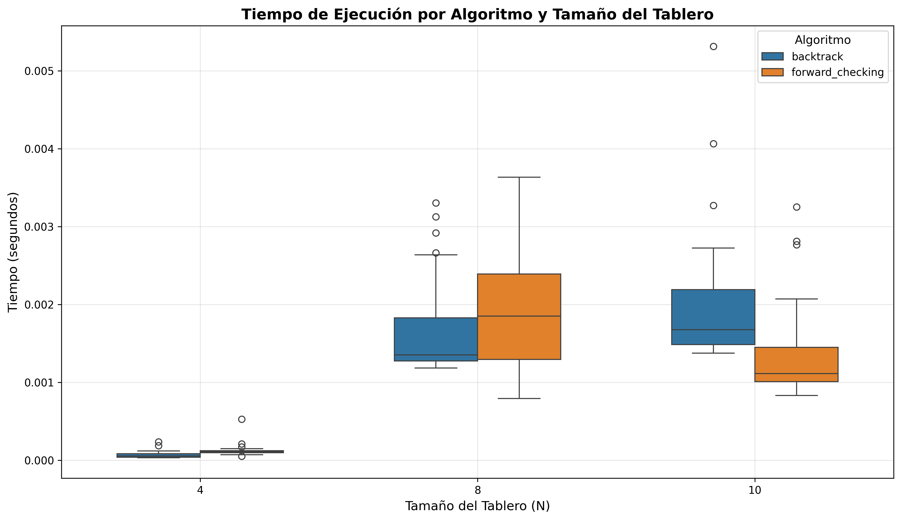
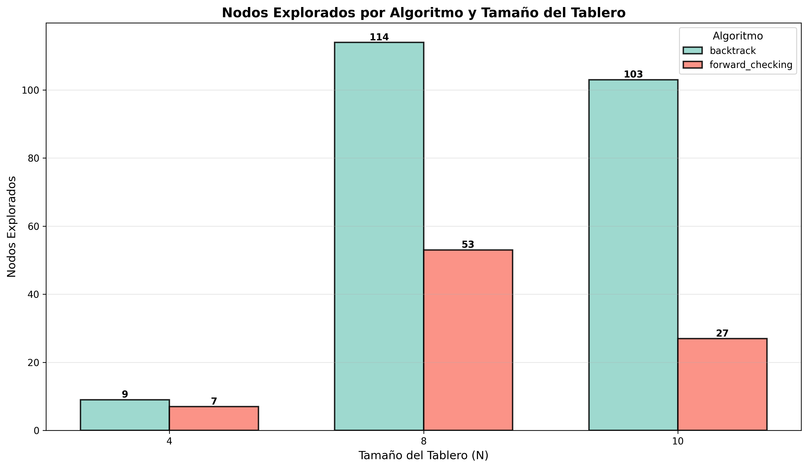

# Trabajo Práctico 5 - Constraint Satisfaction Problems (CSP)

# 1. Formulación CSP del Sudoku

## a. Variables
Una variable por cada celda del tablero.  
Notación: \( X_{r,c} \), donde \( r, c \in \{1, \ldots, N\} \).  
Para el Sudoku clásico: \( N = 9 \).  
**Total:** \( N^2 = 81 \) variables.

## b. Dominios
- Si la celda \((r, c)\) ya tiene una pista con valor fijo \(v\):  
  \( D_{r,c} = \{v\} \)
- Si está vacía:  
  \( D_{r,c} = \{1, 2, \ldots, N\} \)

## c. Restricciones
El Sudoku exige que cada número aparezca **exactamente una vez** en cada fila, columna y subcuadro.

### Filas
Para cada fila \(r\):  
\[
\text{AllDifferent}(X_{r,1}, X_{r,2}, \ldots, X_{r,N})
\]

### Columnas
Para cada columna \(c\):  
\[
\text{AllDifferent}(X_{1,c}, X_{2,c}, \ldots, X_{N,c})
\]

### Subcuadros
El tablero se divide en cajas de \(k \times k\) (con \(k^2 = N\)).  
Para cada bloque \((B_r, B_c)\):  
\[
\text{AllDifferent}\big(X_{r,c} \mid r \in [kB_r + 1, \ldots, k(B_r + 1)],\; c \in [kB_c + 1, \ldots, k(B_c + 1)]\big)
\]

En el Sudoku \(9 \times 9\) (\(k = 3\)) hay:
- 9 restricciones para filas,  
- 9 para columnas,  
- 9 para cajas.  

**Total:** 27 restricciones *AllDifferent*.

## d. Grafo de restricciones
- **Nodo:** variable \(X_{r,c}\).  
- Dos nodos están conectados si **comparten fila, columna o caja**.  
- Cada fila, columna y caja forma un **clique de tamaño \(N\)**.  
- El grafo de restricciones es **muy denso**.

## e. Propagación / Consistencia
- Al fijar un valor en una celda, se elimina ese valor de los dominios de todas las celdas en la misma fila, columna y subcuadro (*forward checking*).  
- Los propagadores de **AllDifferent** son más potentes que usar solo restricciones binarias de desigualdad.

## f. Objetivo
Encontrar una asignación completa:  
\[
X_{r,c} = v \quad \forall r, c \in \{1, \ldots, N\}
\]
que respete todas las restricciones.

No hay función objetivo de optimización:  
Es un **problema de satisfacción pura**.

# 2. Demostración de Inconsistencias (Problema de Coloreo de Mapa)

## Colores disponibles
**Colores:** `red`, `green`, `blue`

## Variables
\[
WA, \; NT, \; SA, \; Q, \; NSW, \; V, \; T
\]

## Vecindades (restricciones \( X \neq Y \))
- **WA:** NT, SA  
- **NT:** WA, SA, Q  
- **SA:** WA, NT, Q, NSW, V  
- **Q:** NT, SA, NSW  
- **NSW:** SA, Q, V  
- **V:** SA, NSW  
- **T:** *(sin vecinos)*

## Asignación parcial dada
\[
WA = red, \quad V = blue
\]

## Inicialización de dominios
\[
\begin{aligned}
D(WA) &= \{red\} \\
D(V) &= \{blue\} \\
D(NT), D(SA), D(Q), D(NSW), D(T) &= \{red, green, blue\}
\end{aligned}
\]

La cola de **AC-3** comienza con todos los arcos \((X, Y)\) para cada restricción \(X \neq Y\).

## Propagación (revisiones clave)

#### 1) Efecto de \( WA = red \)
- Revisar \((NT, WA)\):  
  Como \(WA\) solo permite *red*, eliminamos *red* de \(D(NT)\).  
  → \(D(NT) = \{green, blue\}\)

- Revisar \((SA, WA)\):  
  Eliminamos *red* de \(D(SA)\).  
  → \(D(SA) = \{green, blue\}\)

#### 2) Efecto de \( V = blue \)
- Revisar \((SA, V)\):  
  Quitamos *blue* de \(D(SA)\).  
  → \(D(SA) = \{green\}\) (**dominio unitario**)

- Revisar \((NSW, V)\):  
  Quitamos *blue* de \(D(NSW)\).  
  → \(D(NSW) = \{red, green\}\)

Al volverse unitario \(SA\), AC-3 vuelve a encolar los arcos \((Z, SA)\) para todos sus vecinos:
\[
Z \in \{WA, NT, Q, NSW, V\}
\]

#### 3) Propagar \( SA = green \)
- \((NT, SA)\): eliminar *green*  
  → \(D(NT) = \{blue\}\)

- \((Q, SA)\): eliminar *green*  
  → \(D(Q) = \{red, blue\}\)

- \((NSW, SA)\): eliminar *green*  
  → \(D(NSW) = \{red\}\)

- \((WA, SA)\) y \((V, SA)\): sin cambios (ya distintos de *green*).

Al volverse unitarios \(NT\) y \(NSW\), se re-encolan \((Z, NT)\) y \((Z, NSW)\) para sus vecinos.

#### 4) Propagar \( NT = blue \)
- \((Q, NT)\): eliminar *blue*  
  → \(D(Q) = \{red\}\)

- \((WA, NT)\) y \((SA, NT)\): sin cambios (ya distintos).

Al volverse unitario \(Q\), AC-3 encola \((Z, Q)\) para sus vecinos:
\[
Z \in \{NT, SA, NSW\}
\]

#### 5) Propagar \( Q = red \)
- \((NSW, Q)\): eliminar *red* de \(D(NSW)\).  
  Pero \(D(NSW) = \{red\}\)  
  → **Se vacía:** \(D(NSW) = \emptyset\)

En cuanto algún dominio queda vacío, **AC-3 detecta inconsistencia**.

### Conclusión
La asignación parcial:
\[
WA = red, \quad V = blue
\]
conduce, vía propagación **AC-3**, a:

\[
SA = green, \quad NT = blue, \quad Q = red
\]

Por las restricciones:
\[
NSW \neq SA \;(green), \quad NSW \neq Q \;(red), \quad NSW \neq V \;(blue)
\]

→ **NSW no tiene ningún color disponible.**  

## Implementación de N-Reinas usando CSP

### Algoritmos Implementados

### 1. Backtracking Simple
Algoritmo de búsqueda recursiva que:
- Asigna reinas fila por fila
- Verifica restricciones solo después de hacer la asignación
- Retrocede cuando encuentra un conflicto

### 2. Forward Checking
Extensión del backtracking que:
- Pre-filtra el dominio antes de cada asignación
- Solo considera columnas que no violan restricciones
- Reduce el espacio de búsqueda de manera proactiva

## Gráficos de Análisis

### Distribución de Tiempos de Ejecución

### Distribución de Nodos Explorados

## Comparación con TP4 (Búsqueda Local)

### Diferencias Clave

| Aspecto | CSP (TP5) | Búsqueda Local (TP4) |
|---------|-----------|----------------------|
| **Tipo de búsqueda** | Sistemática, completa | Estocástica, incompleta |
| **Garantía de solución** | Sí (si existe) | No garantizada |
| **Tiempo de ejecución** | Determinista | Variable |
| **Espacio explorado** | Árbol de búsqueda | Vecindario local |
| **Óptimo global** | Primera solución válida | Puede quedar en óptimos locales |

