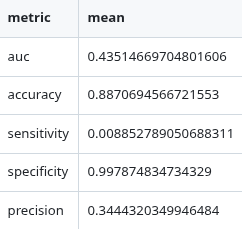

# TP7 – Parte II – Desafío Kaggle: Arbolado público de Mendoza

## 1. Objetivo general
El objetivo fue predecir la **peligrosidad del arbolado público de Mendoza**, entendida como la probabilidad de que un árbol tenga una inclinación peligrosa (`inclinacion_peligrosa = 1`).  
Se buscó un modelo que supere un **AUC de 0.69** en la competencia de Kaggle, manteniendo un flujo reproducible de preprocesamiento, validación y predicción final.

## 2. Preprocesamiento de datos

### 2.1. Limpieza inicial
Se partió de los archivos originales:
- `arbolado-mza-dataset.csv` → conjunto de entrenamiento.
- `arbolado-mza-dataset-test.csv` → conjunto de evaluación Kaggle.

El script `01_load_and_preprocess.R` automatizó las siguientes tareas:

- **Normalización de nombres**: todos los nombres de columnas se convirtieron a minúsculas, reemplazando espacios y puntos por guiones bajos.
- **Eliminación de columnas textuales largas**: se descartó `nombre_seccion` por ser un identificador descriptivo redundante.
- **Conversión de tipos**:
  - `especie` → `factor`
  - `seccion` → `integer` y `seccion_f` (versión categórica)
  - `inclinacion_peligrosa` → `factor` binario (niveles 0 y 1)
- **Conversión de fecha** (`ultima_modificacion`):
  - Parseo con `lubridate::ymd()`
  - Derivación de `anio_modif` y `mes_modif`.

### 2.2. Imputación de valores faltantes
- Las variables numéricas (`altura`, `circ_tronco_cm`, `area_seccion`, `lat`, `long`) se imputaron con la **mediana del conjunto de entrenamiento**.
- Las variables categóricas con valores vacíos se reemplazaron por `"desconocido"`.
- Los parámetros de imputación se guardaron en `preproc_params.rds` para aplicarse también al conjunto de test.

### 2.3. Agrupación y reducción de cardinalidad
Para evitar problemas de **categorías raras** en `especie`, se agruparon las especies con menos de 20 apariciones en la categoría `"OTRA"`.  
Esto redujo significativamente el número de niveles del factor y eliminó el error de *new levels* durante la validación.

### 2.4. Generación de variables derivadas
Se añadieron nuevas columnas que expresan relaciones geométricas entre atributos del árbol:

- `altura_rel = altura / (circ_tronco_cm + 1)` → relación entre altura y circunferencia.  
- `densidad_seccion = circ_tronco_cm / (area_seccion + 1)` → densidad relativa de tronco por superficie de sección administrativa.

Estas nuevas variables buscaban capturar señales estructurales relevantes para la inclinación.

## 3. Modelado y entrenamiento

### 3.1. Modelos base probados
En `03_train_validate_baselines.R` se evaluaron tres modelos principales:

| Modelo | Descripción | Observaciones |
|---------|--------------|---------------|
| `rpart` (default) | Árbol de decisión sin tuning | Punto de partida |
| `rpart` (control) | Árbol ajustado con `cp = 0.001`, `minsplit = 20` | Mejor balance Bias/Varianza |
| `randomForest` | Bosque aleatorio (100 árboles, variables por defecto) | Más robusto ante ruido y desbalance |

Para cada modelo se midieron:
- **Accuracy**
- **Precision**
- **Recall (Sensitivity)**
- **Specificity**
- **AUC** 

## 4. Validación cruzada

### 4.1. Metodología
El script `04_cross_validation.R` implementó una **validación cruzada estratificada de 10 folds**, manteniendo la proporción de clases 0/1 en cada partición.  
En cada iteración se entrenó un modelo `rpart` sobre 9 folds y se evaluó sobre el restante.

### 4.2. Métricas por fold
Por fold se calcularon:
- Accuracy
- Precision
- Sensitivity
- Specificity

## 5. Entrenamiento final y envío Kaggle

### 5.1. Resultados sobre conjunto de validación (80/20)

### 5.2. Resultados en Kaggle

